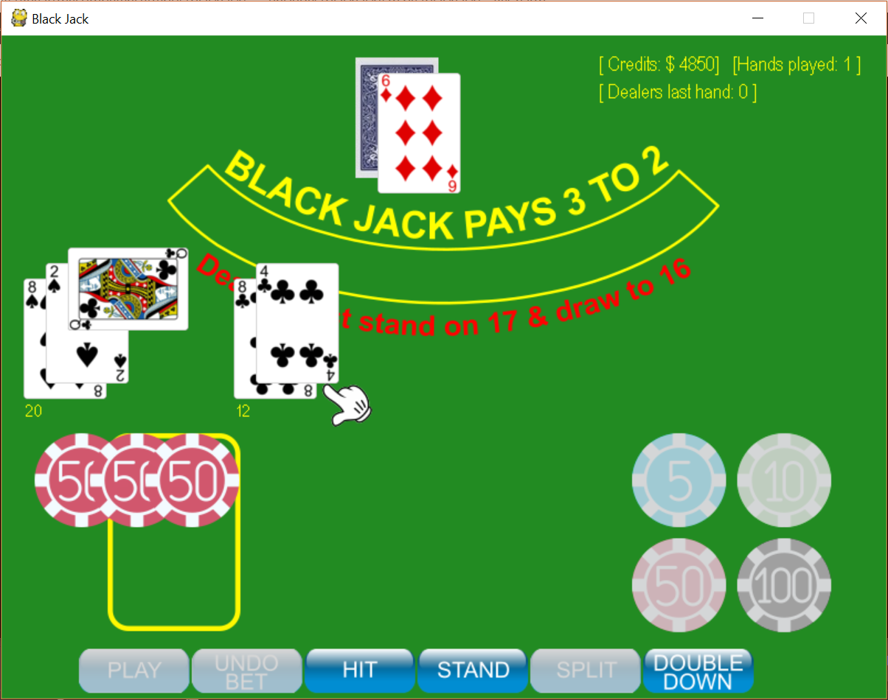
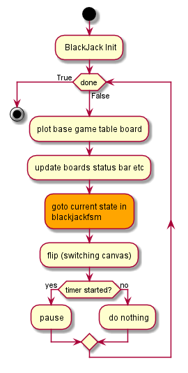
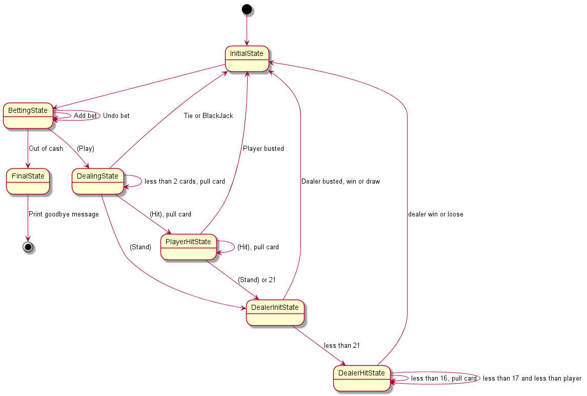

# Black Jack [](https://opensource.org/licenses/MIT)

## Summary
This is a Black Jack game written in python using [pygame](https://www.pygame.org/news)  

The purpose of this project have been to learn python, unit testing and 
documentation of python code as well as exploring pygame.

It is still work in progress with some missing functions and a few bugs.

**Screenshot:**


### Prerequisites before you can play
**Python3:** (my version have been 3.6.1), More info about download can be 
found [here](https://www.python.org/downloads/).   
  
**PIP:** If you're using Python 3.4 (or greater), then PIP comes installed 
with Python by default. If you're not, then read how to do 
[here](https://www.makeuseof.com/tag/install-pip-for-python/).  

**Pygame:** If you haven't installed pygame you can do that from the command 
line with:   
`pip3 install pygame` 

Clone or download the repo to your local machine.  

From a shell *(linux shell, windows command or Git bash)* first make sure you 
are in the project root of *blackjack* and type:   
`python blackjack.py` or `python3 blackjack.py`  


The game should now fire up. If it doesn't work some simple troubleshooting 
could be to check that you are using a compatible version of python with:  
`python --version`  
You should have a version 3.x.x and if that command doesn't work you probably 
have some path problems to sort out first. Other problems? Sorry, that is 
something you have to figure out on your own.  

### Game design
A common pattern writing games in pygame is to create an infinitive loop and 
within that loop build up and plot or "blit" the content on the screen. In the 
end of the loop you "flip" and display the updated content with:  
`pygame.display.flip()`  

I have been using the same pattern and created a finite state machine (FSM) 
containing the main black jack logic which is executed within the main loop. 
See flowchart and fsm below for a hint of how it works:  

**Flowchart:**



**FSM:**

 

### Remaining work
See [Open Issues](https://github.com/torbjornhedqvist/blackjack/issues) for 
remaining work.

### Test Coverage
I have implemented a few test suits to explore how to use 
[unittest](https://docs.python.org/3/library/unittest.html) and you find 
these tests under the `~/blackjack/tests` directory.  
While running these tests I also explored how to examine the amount of test 
coverage the unit tests handled. To do this I have have been using 
[coverage](https://coverage.readthedocs.io/en/coverage-4.5.1x/).  

#### Installation of coverage
If you haven't installed coverage yet, easy to check by typing the following 
command in a shell:  
`coverage --version`  
If that doesn't give a positive response ;) you do as ususal and install with 
pip:  
`pip3 install coverage`

#### Run the coverage reporting
Change directory to `~blackjack/tests/`  
To run one specific unittest and generate a test coverage report at the same 
time this is one example:    
```
coverage run ut_dealers_hand.py
coverage report
```

The following command will generate a html report under the created 
subdirectory *html*. To view, launch index.html in a browser.  
`coverage html`  

If you would like to aggregate the results of multiple test suits into 
one report you can do that by using the option `-a` to the *coverage run* 
command. See example below:
```  
coverage run -a ut_dealers_hand.py
coverage run -a ut_players_hand.py
coverage report
coverage html
```
and so on and so forth ;) You can read more about coverage at these places:  
1. [An Intro to coverage.py](https://www.blog.pythonlibrary.org/2016/07/20/an-intro-to-coverage-py/).  
2. [Combined code coverage over multiple runs](https://stackoverflow.com/questions/22075933/how-to-get-combined-code-coverage-over-multiple-runs-of-python-script).  


### Automatic document generation using Sphinx
To get automatic document generation from inline source code comments I have 
been using sphinx. If you haven't Sphinx installed you can do that from 
command line with:  
`pip3 install -U Sphinx`  

#### Sphinx Setup 
All of below up until section **Build the documentation** is not needed if 
you clone the whole repo. It is more as an instruction if you have to setup 
Sphinx from start.  

In a shell (from command line) go to the project root *~/blackjack* and type:  
`sphinx-quickstart`

***And below you can see which values to change and which to accept as defaults:***  
```
Welcome to the Sphinx 1.7.9 quickstart utility.  

Please enter values for the following settings (just press Enter to  
accept a default value, if one is given in brackets).  

Selected root path: .  

You have two options for placing the build directory for Sphinx output.  
Either, you use a directory "_build" within the root path, or you separate  
"source" and "build" directories within the root path.  
> Separate source and build directories (y/n) [n]: [Enter] (Accept default)  

Inside the root directory, two more directories will be created; "_templates"
for custom HTML templates and "_static" for custom stylesheets and other static
files. You can enter another prefix (such as ".") to replace the underscore. 
> Name prefix for templates and static dir [_]: [Enter] (Accept default)

The project name will occur in several places in the built documentation.
> Project name: Black Jack [Enter]
> Author name(s): Torbjorn Hedqvist [Enter] 
> Project release []: 0.0.1 [Enter] 

If the documents are to be written in a language other than English,  
you can select a language here by its language code. Sphinx will then  
translate text that it generates into that language.  

For a list of supported codes, see  
[http://sphinx-doc.org/config.html#confval-language](http://sphinx-doc.org/config.html#confval-language).  
> Project language [en]: [Enter] (Accept default)

The file name suffix for source files. Commonly, this is either ".txt"  
or ".rst".  Only files with this suffix are considered documents.  
> Source file suffix [.rst]: [Enter] (Accept default)

One document is special in that it is considered the top node of the  
"contents tree", that is, it is the root of the hierarchical structure  
of the documents. Normally, this is "index", but if your "index"  
document is a custom template, you can also set this to another filename.  
> Name of your master document (without suffix) [index]: [Enter] (Accept default) 

Sphinx can also add configuration for epub output:  
> Do you want to use the epub builder (y/n) [n]: [Enter] (Accept default)
Indicate which of the following Sphinx extensions should be enabled:  
> autodoc: automatically insert docstrings from modules (y/n) [n]:` `y [Enter]   
> doctest: automatically test code snippets in doctest blocks (y/n) [n]: [Enter] (Accept default)   
> intersphinx: link between Sphinx documentation of different projects (y/n) [n]: [Enter] (Accept default)  
> todo: write "todo" entries that can be shown or hidden on build (y/n) [n]: [Enter] (Accept default)  
> coverage: checks for documentation coverage (y/n) [n]: [Enter] (Accept default)  
> imgmath: include math, rendered as PNG or SVG images (y/n) [n]: [Enter] (Accept default)  
> mathjax: include math, rendered in the browser by MathJax (y/n) [n]: [Enter] (Accept default)  
> ifconfig: conditional inclusion of content based on config values (y/n) [n]: [Enter] (Accept default)  
> viewcode: include links to the source code of documented Python objects (y/n) [n]:` `y [Enter]
> githubpages: create .nojekyll file to publish the document on GitHub pages (y/n) [n]: [Enter] (Accept default)  

A Makefile and a Windows command file can be generated for you so that you  
only have to run e.g. *make html* instead of invoking sphinx-build directly.  
> Create Makefile? (y/n) [y]: [Enter] (Accept default)
> Create Windows command file? (y/n) [y]: [Enter] (Accept default) 

Creating file .\conf.py.  
Creating file .\index.rst.  
Creating file .\Makefile.  
Creating file .\make.bat.  

Finished: An initial directory structure has been created.  

You should now populate your master file .\index.rst and create other documentation  
source files. Use the Makefile to build the docs, like so:  
   make builder  
where "builder" is one of the supported builders, e.g. html, latex or linkcheck.  
```

This creates a set of configuration files and directories in the root directory 
defined. For instance all files ending in *.rst*, the file *conf.py* and the 
directories `_static, _build and _templates`.  
Read the [sphinx document page](http://www.sphinx-doc.org/en/master/usage/quickstart.html) for detailed instructions.  

#### conf.py update
After the step with *sphinx-quickstart* is finished you have to update the 
*conf.py* file. Under the section `# -- Path setup --` there are three lines 
that needs to be uncommented.  
```
# import os
# import sys
# sys.path.insert(0, os.path.abspath('.'))
```
to:  
```
import os
import sys
sys.path.insert(0, os.path.abspath('.'))
```  

Change `html_theme = 'alabaster'` to `html_theme = 'classic'`  
Why? I just happen to like that theme better :)  

By default the body width of the hml output will be very small, and when 
examining the *source*, it gives a really ugly and unfriendly output where you 
have to scroll right and left all the time.

To fix this add `"body_max_width": "60%"` to the `html_theme_options = {` section, like below:  
```
html_theme_options = {
#    "body_max_width": "none"
    "body_max_width": "60%"
#    "rightsidebar": "true",
#   "relbarbgcolor": "black"
}
```

#### sphinx-apidoc
Then run the *sphinx-apidoc* command to automatically create the documents for 
the project. This will create a corresponding `.rst` file for each `.py` file 
in the project including sub directories. Syntax (for Windows):  
`sphinx-apidoc.exe -o <output> <source or module path> <exclude file(s)>`  

and in our project, (make sure to be in the project root of blackjack):  
`sphinx-apidoc.exe -o . . conf.py`

#### Build the documentation
To generate the documentation you do that with the *sphinx-build* command 
from command line in a shell.  
Syntax: `sphinx-build -b html <sourcedir> <builddir>`  

**Note!** If the builddir doesn't exists it will be created.  

and in our project, (make sure to be in the project root of blackjack):  
`sphinx-build -b html . html`  

The game will start during the document generation which is ok, just close it 
with the `[X]` in the top bar. All generated documentation in html format 
will be stored in the subdirectory *html* and by opening the *index.html* file 
you will see all the documentation generated.  

If you would like to force a rebuild of the documentation use the `-E` option.  
`sphinx-build -E -b html . html`  

### Credits and Acknowledgments 
Free playingcards from 
<https://code.google.com/archive/p/vector-playing-cards/>   

Thank you Kenney Vleugels for contributing with the sounds.
(<http://www.kenney.nl>) 
   
Casino chips made by [Smashicons](https://www.flaticon.com/authors/smashicons) from https://www.flaticon.com/
and is licensed by [CC3.0 BY](http://creativecommons.org/licenses/by/3.0/)

